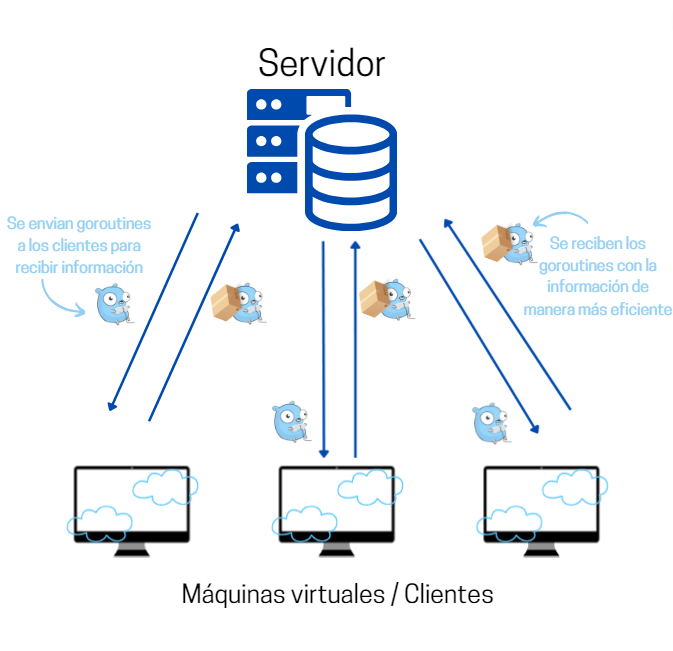

**Universidad Peruana de Ciencias Aplicadas**

**Ciencias de la Computación**

**Programación Concurrente y Distribuida - CC62**

**Tarea Académica 4**

**Docente**

Carlos Alberto Jara García

**Estudiante:**

  - Rebeca Liliana Bravo Navarro                     u201711448
  - Luis Alonso Pineda Knox                          u201915747
  - Nicola Rovegno Chavez                            u20191b823

# Introducción

# Caso de uso

## Problemática

El consumo energético de los edificios representa una parte
significativa del consumo total de energía a nivel global. La eficiencia
energética de los edificios no solo impacta en los costos operativos,
sino también en el medio ambiente, contribuyendo a las emisiones de
gases de efecto invernadero. En este contexto, optimizar la eficiencia
energética de los edificios es crucial para reducir el consumo de
recursos y mitigar el cambio climático. Sin embargo, la evaluación y
mejora de la eficiencia energética de un edificio puede ser un proceso
complejo, influenciado por una variedad de factores como la calidad del
aislamiento, la orientación del edificio, y el tipo de ventanas, entre
otros.

## Solución Propuesta

Para abordar este problema, se propone desarrollar una aplicación que
analice la eficiencia energética de edificios mediante programación
concurrente, canales y algoritmos distribuidos. La aplicación se
estructurará bajo una arquitectura cliente/servidor, permitiendo la
distribución del procesamiento de los datos a través de múltiples hosts,
donde la comunicación se realizará a través de puertos y la
sincronización se gestionará utilizando canales.

## Dataset

El conjunto de datos a emplear se obtiene de la reconocida plataforma
Kaggle (*Linear Regression*, 2022). Este dataset ha sido creado con el
propósito específico de ser utilizado en la aplicación de modelos de
regresión lineal. Consta de un millón de registros, cada columna dentro
del dataset representa una variable independiente (X) y una variable
dependiente (Y), estableciendo así una relación directa entre ambas,
ideal para el desarrollo y prueba de modelos de regresión lineal.

_Captura de pantalla de la plataforma Kaggle con el dataset utilizado._
_Nota: En esta ocasión no se necesitó realizar una limpieza de data._

### Características de las variables del dataset

**Variable Independiente (X):** Características del edificio evaluadas
en una escala de 1 a 100. Estas características incluyen calidad del
aislamiento, orientación del edificio, tipo de ventanas, etc.

**Variable Dependiente (Y):** Índice de eficiencia energética del
edificio, fluctuando entre -10.5 y 111.

### Diagrama de solución

_Diagrama explicando la estructura utilizada para resolver el problema._

## Pruebas y resultados

Se realizó una conexión entre servidor y cliente. Siendo el servidor el
que gestiona los datos para múltiples clientes y donde se realizan los
cálculos y el cliente el que entrega los datos y recibe el resultado.

## Código
### Cliente

_Configuración y conexión al servidor_

Se configura el servidor para escuchar en una dirección IP y puerto
específicos (serverAddr). Luego, establece una conexión TCP con el
servidor mediante net.Dial(\"tcp\", serverAddr). Si ocurre un error al
intentar la conexión, log.Fatalf registrará un mensaje de error y
finalizará el programa. Para asegurar que la conexión se cierre
correctamente al finalizar el programa, incluso si ocurre un error, se
utiliza defer conn.Close().

_Descarga del archivo CSV_

El código especifica la URL del archivo CSV que se va a descargar (url).
Luego, llama a la función downloadCSV(url) para descargar y leer el
contenido del archivo CSV. Si ocurre un problema durante la descarga,
log.Fatalf registrará un mensaje de error y terminará el programa.

_Procesamiento del archivo CSV_

_Envío de datos en lotes_

El código primero define batchSize como 1000, lo que significa que
enviará 1000 líneas del CSV al servidor en cada lote. Luego, utiliza un
bucle for para iterar a través de las líneas del CSV en incrementos del
tamaño del lote. Dentro del bucle, batch := csvData\[i:end\] crea un
lote de líneas del CSV desde la línea actual i hasta end (i +
batchSize). Cada fila del lote se convierte en una cadena de texto
separada por comas con strings.Join(row, \",\") + \"\\n\". Luego,
conn.Write(\[\]byte(data)) envía cada fila del lote al servidor. Para
simular el tiempo de procesamiento del servidor, el código hace una
pausa con time.Sleep(500 \* time.Millisecond). Finalmente,
fmt.Printf(\"Se terminó un cálculo \[%d/%d\]\\n\", end, numLineas)
imprime un mensaje en la consola indicando que se ha terminado de
procesar un lote, mostrando cuántas líneas se han procesado hasta el
momento y el total de líneas a procesar.

_Recepción y visualización de los resultados_

bufio.NewReader(conn).ReadString(\'\\n\') lee la respuesta del servidor
hasta el carácter de nueva línea. log.Fatalf registra un mensaje de
error y termina el programa si hay un problema al recibir los resultados
del servidor. fmt.Println(\"\\nTodos los cálculos terminados\") imprime
un mensaje indicando que todos los cálculos han terminado. Finalmente,
fmt.Println(\"La regresión final es:\", response) imprime la regresión
final calculada por el servidor.

### Servidor

_Configuración y inicio del servidor_

-   port := \":12345\": Define el puerto en el que el servidor escuchará
    las conexiones entrantes.

-   net.Listen(\"tcp\", port): Inicia un servidor TCP que escucha en el
    puerto especificado.

-   log.Fatalf: Registra un mensaje de error y termina el programa si
    hay un problema al iniciar el servidor.

-   defer ln.Close(): Asegura que el listener se cierre al final del
    programa.

_Aceptación de conexiones_

-   ln.Accept(): Acepta una conexión entrante del cliente.

-   log.Fatalf: Registra un mensaje de error y termina el programa si
    hay un problema al aceptar la conexión.

-   defer conn.Close(): Asegura que la conexión se cierre al final del
    programa.

-   fmt.Println(\"Cliente conectado:\", conn.RemoteAddr()): Imprime un
    mensaje indicando que un cliente se ha conectado, mostrando su
    dirección.

_Lectura del número total de líneas_

-   bufio.NewReader(conn): Crea un nuevo lector de búfer para leer datos
    de la conexión.

-   reader.ReadString(\'\\n\'): Lee una línea de texto del cliente.

-   strings.TrimSpace(numLinesStr): Elimina espacios en blanco al
    principio y al final de la cadena.

-   strconv.Atoi(numLinesStr): Convierte la cadena de texto en un
    entero.

_Lectura y procesamiento de datos del cliente_

-   for i := 0; i \< numLines; i++: Itera sobre el número total de
    líneas.

-   reader.ReadString(\'\\n\'): Lee una línea de datos del cliente.

-   strings.TrimSpace(dataStr): Elimina espacios en blanco al principio
    y al final de la cadena.

-   strings.Split(dataStr, \",\"): Divide la cadena en un slice usando
    la coma como separador.

_Conversión de datos y actualización de sumas_

-   strconv.ParseFloat(data\[0\], 64): Convierte la primera parte de la
    cadena (x) en un número de punto flotante.

-   strconv.ParseFloat(data\[1\], 64): Convierte la segunda parte de la
    cadena (y) en un número de punto flotante.

-   sumX += x, sumY += y, sumXY += x \* y, sumXX += x \* x: Actualiza
    las sumas necesarias para calcular la regresión lineal.

-   bar.Add(1): Incrementa la barra de progreso en 1.

_Cálculo de la regresión lineal y envío de la respuesta al cliente_

-   n := float64(numLines): Convierte el número de líneas en un número
    de punto flotante.

-   b := (n\*sumXY - sumX\*sumY) / (n\*sumXX - sumX\*sumX): Calcula el
    coeficiente b de la regresión lineal.

-   a := (sumY - b\*sumX) / n: Calcula el coeficiente a de la regresión
    lineal.

-   fmt.Sprintf(\"%.6f %.6f\", a, b): Formatea los coeficientes a y b en
    una cadena.

-   conn.Write(\[\]byte(regression + \"\\n\")): Envía la cadena de
    regresión al cliente.

# Resultado Final

_Resultado final_

Podemos ver que luego de unos segundos, el servidor procesa toda la
información enviada por el cliente, tras lo cual le retorna un resultado
con el valor de la regresión. El cliente da por concluida su ejecución
al recibir el resultado.

## Conclusiones

El uso de programación distribuida para abordar la eficiencia energética
en edificios ofrece ventajas significativas como escalabilidad para
manejar grandes volúmenes de datos y procesamiento distribuido
eficiente, mejorando la eficiencia al optimizar recursos
computacionales. Además, proporciona flexibilidad para implementar
algoritmos complejos de modelado y simulación, aumenta la resiliencia
del sistema al evitar puntos únicos de fallo, y facilita la colaboración
entre expertos para análisis detallados y decisiones informadas sobre
mejoras energéticas, contribuyendo así a la reducción del consumo de
energía y las emisiones de gases de efecto invernadero.

# Bibliografía

*Linear regression*. (2022). Kaggle.
<https://www.kaggle.com/datasets/fareedkhan557/linear-regression>

# Anexos

-   Enlace de github: <https://github.com/weez97/LinearRegressionChan>

-   Enlace video: <https://youtu.be/qee43qB5XFs>
